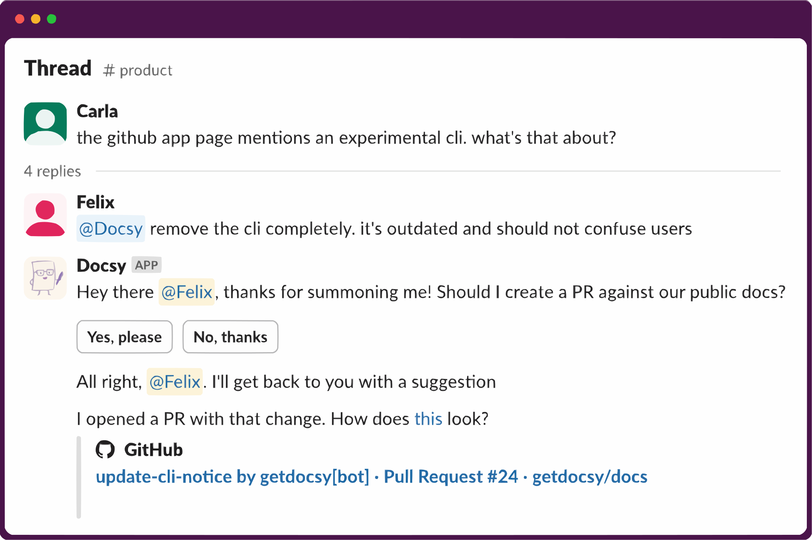

# Docsy Slack Bot

Docsy turns Slack threads into GitHub pull requests against your documentation repository.

<div align="center">
  
</div>

Deploy Docsy yourself or check the [documentation](https://docs.getdocsy.com/) for getting started with the hosted version.

## Development

### Local Setup

1. Start the Slack bot:
```bash
just slack
```

2. Start ngrok in a separate terminal:
```bash
just ngrok
```

### Database Migrations

To create a new database migration from the project root:

```bash
poetry shell
alembic --config=docsy/alembic.ini revision --autogenerate -m "your migration message"
```

## Deployment

### Docker Deployment

The application requires a persistent volume mapped to `/app/data/` within the container.

#### Build the Container

```bash
docker build -t getdocsy/slack-bot .
```

#### Run the Container

```bash
docker run -v=/Users/xilef/Documents/docsy/data/:/app/data \
  --env-file=secrets.docsy-dev.docker.env \
  -p 3000:3000 \
  felixzieger/docsy
```

### Environment Configuration

Create a `secrets.docsy-dev.docker.env` file with the following environment variables:

```env
LOG_LEVEL=DEBUG
OPENAI_API_KEY=sk-...
SLACK_SIGNING_SECRET=...
SLACK_CLIENT_ID=...
SLACK_CLIENT_SECRET=...
GITHUB_APP_ID=...
GITHUB_APP_PRIVATE_KEY=...
```

#### Environment Variables Reference

| Variable | Description | Notes |
|----------|-------------|-------|
| `LOG_LEVEL` | Logging verbosity | Options: `DEBUG`, `INFO` |
| `OPENAI_API_KEY` | OpenAI API key | Required for AI features |
| `SLACK_SIGNING_SECRET` | Slack app signing secret | Required for Slack integration |
| `SLACK_CLIENT_ID` | Slack app client ID | Required for Slack integration |
| `SLACK_CLIENT_SECRET` | Slack app client secret | Required for Slack integration |
| `GITHUB_APP_ID` | GitHub App ID | Required for GitHub integration |
| `GITHUB_APP_PRIVATE_KEY` | GitHub App private key | Must be formatted without newlines. Use: `awk '{printf "%s\\n", $0}' github-app.pem` |
